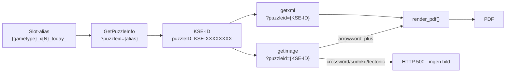
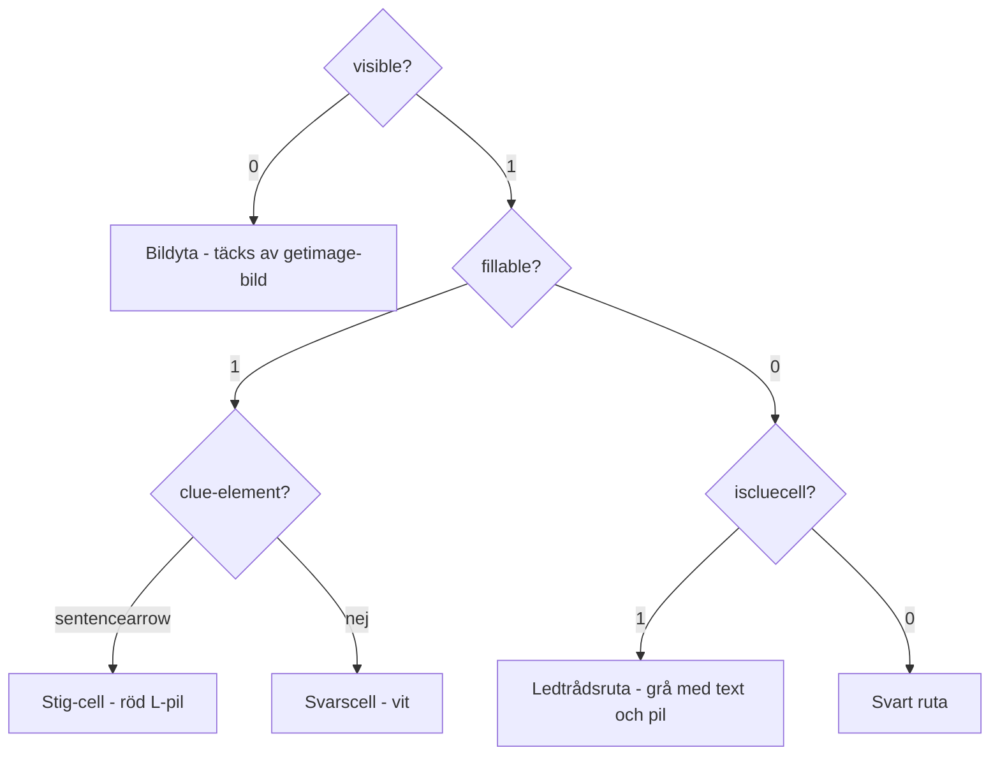

# Keesing Content API - spec

Dokumenterar vad vi lärt oss om Keesing-APIet som används av
`playpuzzlesonline.com` (och sannolikt andra licensierade utgivare).

## Bakgrund

`playpuzzlesonline.com` är en tunn wrapper som laddar Keesing-spelaren
(`web.keesing.com/pub/player/v2.25.6/dist/main-bundle.js`) via en `<div
id="puzzle-portal" data-customerid="dnmag">`. All pussel-logik och alla
API-anrop sker inuti bundlen. **Ingen JS-rendering behövs** för att hämta
data - alla endpoints är enkla HTTP-anrop.

## Klient-ID:n och kända spel

**Portal-URL (playpuzzlesonline):** `https://playpuzzlesonline.com/{client_id}/?gametype={gametype}&puzzleid={gametype}_{slot}_today`
**Portal-URL (braintainment):** `https://portal.braintainment.com/{client_id}/?gametype={gametype}&puzzleid={gametype}_{slot}_today`

`bn` är en gemensam pool för hela Bonnier News-nätverket (Expressen, Sydsvenskan, Ångermanland m.fl.).
Varje tidning har ett eller flera dedikerade slots. Slot-nummer framgår av portalsidans `puzzleid`-parameter.
Titelfältet i XML är alltid tomt för `bn` (liksom för `dnmag`) - ingen XML-metadata avslöjar vilken tidning sloten tillhör.

### dnmag (Dagens Nyheter)

| Gametype | Slots | Gridstorlek | Anteckningar |
|----------|-------|-------------|--------------|
| `arrowword_plus` | x1-x9 | varierar | 9 pilkorsord per rullande vecka, x9 = Söndagskrysset |
| `crossword` | x1-x6 | 10x10, 11x5, 13x13 | x1-x4: "Bryderi" (10x10), x5: kompaktformat (11x5), x6: "Klassikern" (13x13). `difficulty` i XML alltid 1 |
| `sudoku` | x1-x21 | 9x9 | 3 sudokus/dag x 7 dagar. Svårighetsgrad per slot via `difficulty` (1-7) och `ipsrecipe` |
| `tectonic` | x1 | 9x5 | Lättare format (difficulty=2) |

### bn (Bonnier News-poolen)

| Gametype | Slots | Gridstorlek | Anteckningar |
|----------|-------|-------------|--------------|
| `arrowword_plus` | x1-x34+ | varierar | x1-x25 dagliga (rullande ~1 vecka), x26-x34 äldre/veckopussel |
| `crossword` | x1-x34+ | 7x9, 5x5 | x1-x2,x4-x7 m.fl.: "BNLO" 7x9, x3,x19 m.fl.: "Gota" 5x5 |
| `sudoku` | x1-x34+ | 9x9 | Varierad svårighetsgrad (1-5 stjärnor) |
| `tectonic` | x1-x27+ | 9x9, 8x8 | Blandad gridstorlek per slot, alla difficulty=3 |

## API-flöde



## API-endpoints

Bas-URL: `https://web.keesing.com`

### GetPuzzleInfo (metadata)

```
GET /Content/GetPuzzleInfo?clientid={clientid}&puzzleid={puzzleid}&epochtime={ts}
```

`epochtime` kan sättas till `1` (ignoreras av servern). `puzzleid` kan vara
antingen ett slot-alias (`arrowword_plus_x1_today_`) eller ett KSE-ID (`KSE-11360886`).

Returnerar JSON med samtliga fält:

```json
{
  "puzzleID":    "KSE-11360886",
  "puzzleType":  "Arrowword_Plus",
  "category":    "Words",
  "title":       "",
  "subtitle":    "",
  "newPuzzle":   false,
  "order":       1,
  "date":        "2026-04-27T00:00:00+02:00",
  "url":         "https://web.keesing.com/pub/player/v1.4/site/dnmag/...",
  "level":       3,
  "showDisabled": false,
  "variation":   "",
  "audience":    "",
  "puzzleState": null,
  "region":      null,
  "language":    null,
  "locale":      null,
  "options":     null,
  "displayOptions": null,
  "extraOptions": null
}
```

| Fält | Typ | Beskrivning |
|------|-----|-------------|
| `puzzleID` | string | KSE-ID, används för getxml/getimage. `null` om pusslet saknas/ej tillgängligt |
| `puzzleType` | string | `"Arrowword_Plus"`, `"Crossword"`, `"Sudoku"`, `"Tectonic"` |
| `category` | string | `"Words"` för korsord/arrowword, `"Numbers"` för sudoku/tectonic |
| `title` | string | Alltid tom (`""`) - hämta titel från getxml istället |
| `subtitle` | string | Alltid tom i observerade svar |
| `newPuzzle` | bool | Huruvida pusslet publicerats idag |
| `order` | int | Löpnummer för sloten (t.ex. 1 för x1, 9 för x9 = Söndagskrysset) |
| `date` | string | ISO 8601 med tidzon - publiceringsdatumet |
| `url` | string | Direktlänk till Keesing-spelaren för detta pussel |
| `level` | int | Alltid `3` i observerade svar (ej detsamma som svårighetsgrad) |
| `showDisabled` | bool | Alltid `false` i observerade svar |
| `variation` | string | Alltid tom i observerade svar |
| `audience` | string | Alltid tom i observerade svar |
| `puzzleState` | null | Alltid `null` |
| `region` | null | Alltid `null` |
| `language` | null | Alltid `null` |
| `locale` | null | Alltid `null` |
| `options` | null | Alltid `null` |
| `displayOptions` | null | Alltid `null` |
| `extraOptions` | null | Alltid `null` |

**Notera:** Svårighetsgrad exponeras **inte** i GetPuzzleInfo. Den finns i XML-filen
(`difficulty`-attributet på `<puzzle>` och `ipsrecipe` i arrowword_plus).

### getxml (puzzle-data inkl. titel)

```
GET /content/getxml?clientid={clientid}&puzzleid={puzzleid}
```

Returnerar UTF-8 XML med BOM (`\xef\xbb\xbf`) - strip innan parse.
`puzzleid` ska vara KSE-ID (inte slot-alias).

### getimage (PNG-bild)

```
GET /content/getimage?clientid={clientid}&puzzleid={puzzleid}
```

Returnerar `image/png` för arrowword_plus (300 KB - 1,7 MB).
Returnerar HTTP 500 för crossword, sudoku och tectonic - dessa renderas
enbart från XML utan bild.

Bilden täcker hela gridytan. Osynliga celler (`visible=0`) i grid definierar
bildens bounding box - den klistras in där vid rendering.

## Pussel-ID:n och slots

### Slot-format (alias)

```
{gametype}_x{N}_today_
```

Notera det avslutande understrecket. `_today_`-aliasen ger alltid det senast
tillgängliga pusslet per slot - ungefär 7-9 dagars bakåtrullning.

**Duplikat-kontroll:** kontrollera alltid KSE-ID för att undvika dubbellagring
om samma pussel är tillgängligt via flera slots.

## Gametype: arrowword_plus (Pilkorsord)

Renderas från XML + PNG-bild. Variation: `Arrowword DPG`.

### XML-struktur

```xml
<puzzle id="KSE-..." variation="Arrowword DPG" width="15" height="19"
        ipsrecipe="DN_CW1313_Klassikern_Intern_NoRW" difficulty="1" ...>
  <title>Måndagskrysset</title>
  <byline>Lina Otterdahl</byline>
  <grid>
    <cells>
      <cell x="0" y="0" visible="1" fillable="1" iscluecell="0" />
      <cell x="1" y="0" visible="0" fillable="0" iscluecell="0" />
      <cell x="2" y="0" visible="1" fillable="0" iscluecell="1">
        <clue arrow="arrowdown" groupindex="1" wordindex="3">ledtrådstext</clue>
      </cell>
      ...
    </cells>
  </grid>
  <sentences>
    <sentence groupid="..." length="5" content="TAPIR">
      <word content="TAPIR" length="5">
        <cell x="4" y="8" />
        <cell x="4" y="9" />
        ...
      </word>
    </sentence>
  </sentences>
</puzzle>
```

`ipsrecipe` kodar pussel-format och svårighetsgrad (t.ex. `Shared Sudoku 9x9 5*`).
`difficulty` på `<puzzle>` är alltid 1 för arrowword_plus.

#### Celltyper



| visible | fillable | iscluecell | Typ |
|---------|----------|------------|-----|
| `1` | `1` | `0` | Svarscell (vit, fylls av spelaren) |
| `1` | `0` | `1` | Ledtrådsruta (grå, innehåller clue-element) |
| `1` | `0` | `0` | Svart ruta |
| `0` | `0` | `0` | Bildyta (täcks av getimage-bilden) |

#### Clue-element

```xml
<clue arrow="arrowdownright" groupindex="2" wordindex="5">ledtrådstext</clue>
```

| Attribut | Beskrivning |
|----------|-------------|
| `arrow` | Piltyp - se Pilrendering nedan |
| `groupindex` | `1` = vågrätt, `2` = lodrätt |
| `wordindex` | Löpnummer inom gruppen |
| text | Ledtråden. `\` i texten markerar stavelsegränser/radbrytningspunkter |

Special: clue-text `Quiz_RedCircle_N.ai` = quiz-referensruta (se Quiz-celler nedan).

#### Quiz-celler (bildfrågeceller)

Celler med clue-text `Quiz_RedCircle_N.ai` refererar till bildgåtor.
Numret N (1-indexerat) matchar positionen i `<sentences>`-listan.

Svarscellerna för quiz-gåtan definieras i `<sentences>`, **inte** i `<grid>`.
De kan finnas som `fillable=1`-celler i grid (x3) eller saknas helt (x1).

Renderingen visar:
- Quiz-referensrutan: ljusgul bakgrund + röd fylld cirkel med vitt nummer
- Svarscellerna: ljusgul bakgrund (oavsett om de är fillable i grid eller ej)

#### Stig-celler (sentencearrow - bildpil)

Vissa pusslar har `fillable=1`-celler med en clue vars `arrow`-attribut börjar på
`sentencearrow` (t.ex. `sentencearrowdoubledownright`). Dessa är **inte** svarsceller
utan pilceller som visar vägen från bildytan till svarsrutorna i `<sentences>`.

| Egenskap | Värde |
|----------|-------|
| `fillable` | `1` (trots att det inte är en svarscell) |
| `iscluecell` | `0` |
| clue `arrow` | börjar med `sentencearrow` |
| clue text | tom/whitespace |

Bakåtgången för att hitta mellanceller längs `dirs[0]`-riktningen stoppas vid
`visible=0` (bildyta) **eller** `fillable=0` (ledtrådsruta eller svart ruta).

Renderingen: vit bakgrund + en sammansatt röd L-pil över alla stig-celler.

### PDF-rendering (Arrowword DPG)

`render_pdf(xml_bytes, output, image_bytes=png_bytes)` bygger SVG från XML
och konverterar till PDF via cairosvg. Cellstorlek anpassas automatiskt för A4
(~50px för 15-kolumns-grid).

#### Textrendering i ledtrådsrutor

Uttömmande sökning över alla kombinationer av mellanslags- och stavelsesnitt
för maximal fontstorlek:
- Strategi A: enbart mellanslag (hela ord)
- Strategi B: även stavelsesnitt (pyphen + XML-tips) med bindestreck vid brott

B föredras om den ger klart större font, men ej om A redan passar på en rad
med tillräcklig storlek, eller om A är inom 95% av B utan stavelsefragment.

#### Expansion av ledtrådsrutor in i bildytan

Ledtrådsrutor som gränsar till en osynlig cell (bildyta) kan expandera in i den
för att ge mer plats åt lång text. Renderingen sker i ett utökat rektangelområde
som täcker både ledtrådsrutan och den osynliga cellen.

Kriterier för expansion (alla måste uppfyllas):
1. Den osynliga cellen får ha max 1 osynlig granne (exkl. källcellen) - dvs det
   är en kantcell i bildytan, inte ett inre bildområde.
2. Expansionsriktningen får inte vara en pilriktning för clue-elementet.

Konfliktlösning när flera ledtrådsrutor konkurrerar om samma osynliga cell:

| Prioritet | Villkor |
|-----------|---------|
| 0 (bäst) | Bilden slutar vid expansionscellen - cellen bortom är synlig |
| 1 | Bilden fortsätter bortom - fler osynliga celler i riktningen |
| 2 (sämst) | Ledtrådsrutan har diagonal primärpil (t.ex. `arrow4590leftdown`) |

Vid lika prioritet: koordinatordning (minst y, sedan minst x) avgör.

#### Pilrendering

Pilindikatorer ritas i den angränsande svarscellen (inte i ledtrådsrutan).

| Arrow-namn | Pil placeras i |
|------------|----------------|
| `arrowdown` / `arrowdownbottom` | cellen nedanför |
| `arrowdownright` | cellen nedanför |
| `arrowrightdown` / `arrowrighttop` / `arrowrightdowntop` | cellen till höger |
| `arrowleftdown` | cellen till vänster sedan ned (L-pil) |
| `arrow4590rightdown` / `arrow4590downright` | diagonalt nedre-höger |
| `arrow4590leftdown` | diagonalt nedre-vänster |

#### Ordavgränsare i svarsceller

Flerordssvar (med mellanslag i `puzzleword`) markeras med en röd ifylld triangel
(1/5 cellhöjd) vid ordgränsen. Riktning baseras på `_cell_dir` mellan angränsande
svarsceller i ordets path.

#### Svängindikator för L-formade meningar

Svarsceller där ett ord svänger (riktningsbyte) markeras med en liten svart L-pil
i svängens ytterhörn. Riktningsbyte identifieras via `cells/cell`-elementet i XML.

### Variation: PuzzleConstruction Arrowword, Arrowword Pictorial

Saknar ledtrådstexter i XML - konverteras direkt från PNG via `img2pdf`.

## Gametype: crossword (Vanligt korsord)

`getimage` returnerar HTTP 500 - ingen bild. Allt renderas från XML.

`difficulty` på `<puzzle>` är alltid `1` för observerade crossword-pussel
(redaktionell svårighetsgrad anges inte i API-data).

### XML-struktur

```xml
<puzzle type="Crossword" variation="Crossword General"
        width="10" height="10" difficulty="1">
  <title />
  <grid>
    <cells>
      <cell x="0" y="0" visible="1" content="F" giveaway="0" fillable="1" />
      <cell x="1" y="0" visible="1" content=""  giveaway="0" fillable="0" />
      ...
    </cells>
  </grid>
  <wordgroups>
    <wordgroup index="1" kind="horizontal">
      <header>Vågrätt</header>
      <words>
        <word length="10" content="INTERVJUAT" giveaway="0" number="6">
          <cells>
            <cell x="0" y="1" />
            ...
          </cells>
          <puzzleword>intervjuat</puzzleword>
          <clue>varit frågvis</clue>
        </word>
      </words>
    </wordgroup>
    <wordgroup index="2" kind="vertical">...</wordgroup>
  </wordgroups>
</puzzle>
```

#### Celltyper

Alla celler är `visible=1`. Inget `iscluecell`- eller `arrow`-attribut.

| fillable | Typ |
|----------|-----|
| `1` | Svarscell (vit) |
| `0` | Svart ruta (avdelare) |

`content` innehåller rätt svar oavsett `giveaway`. `giveaway="1"` = förifylld cell.

#### Ledtrådar och numrering

Ledtrådar finns i `<wordgroups>/<wordgroup>/<words>/<word>/<clue>`.
Varje ord har `number`-attributet som visas i övre vänstra hörnet av ordets
första cell. Numrering är inte sammanhängande - luckor förekommer.

`<puzzleword>` innehåller svaret i lowercase med mellanslag för flerordssvar.
`content` på `<word>` är svaret i versaler utan mellanslag.

#### Rendering (ej implementerad)

Tänkt renderingsansats:
- Grid med svarsceller (vita) och svarta rutor
- Cellnummer i övre vänstra hörnet (liten font) för ordstarter
- Separat kluelist under grid: "Vågrätt" och "Lodrätt" med nummer och text
- Cellstorlek anpassas för A4

## Gametype: sudoku

`getimage` returnerar HTTP 500 - ingen bild. Allt renderas från XML.

Svårighetsgrad anges i `difficulty`-attributet (1-7) och i `ipsrecipe`
(t.ex. `Shared Sudoku 9x9 5*`).

### XML-struktur

```xml
<puzzle type="Sudoku" variation="Sudoku 9x9" variationcode="su9di"
        width="9" height="9" difficulty="5">
  <title>Sudoku</title>
  <grid>
    <cells>
      <cell x="0" y="0" visible="1" content="8" giveaway="1" />
      <cell x="1" y="0" visible="1" content="2" giveaway="0" />
      ...
    </cells>
  </grid>
</puzzle>
```

#### Cellattribut

| Attribut | Beskrivning |
|----------|-------------|
| `content` | Rätt svar (1-9), alltid satt oavsett `giveaway` |
| `giveaway` | `1` = förifylld (visas i startläget), `0` = tom (spelaren fyller i) |

#### Rendering (ej implementerad)

Tänkt renderingsansats:
- 9x9 grid med tunna inre linjer och tjocka kanter runt 3x3-boxarna
- Förifyllda siffror (`giveaway=1`) i fetstil eller med grå bakgrund
- Tomma celler lämnas vita
- Svårighetsgrad och datum som rubrik

## Gametype: tectonic

`getimage` returnerar HTTP 500 - ingen bild. Allt renderas från XML.

Varje region innehåller 1-5 celler. Siffrorna 1..regionstorlek ska placeras
en gång var i regionen, utan upprepning i angränsande celler (alla 8 riktningar).

### XML-struktur

```xml
<puzzle type="Tectonic" variation="Tectonic" variationcode="tectc"
        width="9" height="9" difficulty="3">
  <title>Tectonic</title>
  <grid>
    <colors>
      <color id="1" name="color1" ARGB="0xffba55d3" />
      <color id="2" name="color2" ARGB="0xffe0ffff" />
      ...
    </colors>
    <cells>
      <cell x="0" y="0" visible="1" content="2" giveaway="0" />
      ...
    </cells>
    <regions>
      <region colorid="1" border="1">
        <cells>
          <cell x="7" y="5" />
          <cell x="7" y="6" />
          <cell x="8" y="6" />
          ...
        </cells>
      </region>
      ...
    </regions>
    <constraints />
  </grid>
</puzzle>
```

#### Cellattribut och regioner

| Attribut | Beskrivning |
|----------|-------------|
| `content` | Rätt svar, alltid satt oavsett `giveaway` |
| `giveaway` | `1` = förifylld, `0` = tom |
| `colorid` (på region) | Refererar till `<color id>` - anger bakgrundsfärg |
| `ARGB` (på color) | Hex-färg med alpha (`0xff` = helt ogenomskinlig) |

#### Rendering (ej implementerad)

Tänkt renderingsansats:
- Grid där varje cell färgas med regionens bakgrundsfärg
- Tjocka kanter ritas mellan celler som tillhör olika regioner
- Tunna kanter ritas mellan celler i samma region
- Förifyllda siffror i fetstil; tomma celler lämnas vita

## Implementationsnoter

- Inget cookie/session-krav för läsoperationer
- BOM (`\xef\xbb\xbf`) i XML-svaret - strip innan parse
- `epochtime`-parametern i GetPuzzleInfo kan sättas till `1`
- Slot-alias kan användas direkt i GetPuzzleInfo; getxml/getimage kräver KSE-ID
- `puzzleID: null` i GetPuzzleInfo-svaret = pusslet finns inte/ej tillgängligt
- Svårighetsgrad exponeras ej i GetPuzzleInfo - finns i XML `difficulty`-attribut
  och `ipsrecipe` (arrowword_plus)
